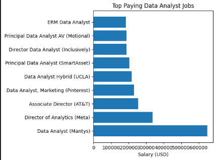
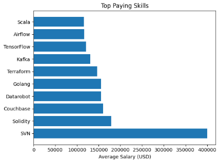

# 📊 Data Analyst Job Market Analysis (SQL Project)

## 1. Introduction  

This project analyzes a large dataset of job postings to uncover insights into **remote data analyst roles**, focusing on:

- Top-paying jobs  
- Skills required for high-paying roles  
- Most in-demand skills  
- Highest-paying skills  
- Optimal skills (high demand + high salary)  


## 2. Background  

The data analytics field is rapidly evolving, with increasing overlap between analytics, engineering, and machine learning.  

This project aims to answer a key question:  

👉 **What skills should a data analyst learn to maximize employability and salary?**

## 3. Tools Used  

- SQL (PostgreSQL) – Data querying  
- VS Code – Development  
- GitHub – Documentation  
- Python / Power BI – Visualizations (optional)  

## 4. The Analysis
### 🔹 QUESTION 1: TOP PAYING REMOTE DATA ANALYST JOBS
📊 

```
SELECT
    job_id,
    job_title,
    job_location,
    job_schedule_type,
    salary_year_avg,
    job_posted_date,
    name as company_name
FROM
    job_postings_fact as job_postings
LEFT JOIN
    company_dim as company ON job_postings.company_id = company.company_id

WHERE
    job_title_short = 'Data Analyst' and job_location = 'Anywhere' and salary_year_avg is not NULL
ORDER BY
    salary_year_avg DESC
LIMIT 10;

```
| Job Title                          | Company        | Salary ($) | Type      |
| ---------------------------------- | -------------- | ---------- | --------- |
| Data Analyst                       | Mantys         | 650,000    | Full-time |
| Director of Analytics              | Meta           | 336,500    | Full-time |
| Associate Director - Data Insights | AT&T           | 255,830    | Full-time |
| Data Analyst, Marketing            | Pinterest      | 232,423    | Full-time |
| Data Analyst (Hybrid/Remote)       | UCLA Health    | 217,000    | Full-time |
| Principal Data Analyst             | SmartAsset     | 205,000    | Full-time |
| Director, Data Analyst             | Inclusively    | 189,309    | Full-time |
| Principal Data Analyst (AV)        | Motional       | 189,000    | Full-time |
| Principal Data Analyst             | SmartAsset     | 186,000    | Full-time |
| ERM Data Analyst                   | Get It Recruit | 184,000    | Full-time |

  

📌 Explanation   
- The salary distribution is highly skewed:  
  - One extreme outlier ($650K) significantly exceeds others  
- Most high-paying roles are:  
   - Senior-level (Director, Principal)
- Even “Data Analyst” roles at top companies can pay:  
  - $200K remotely  

🔑 Key Insight:  
👉 Remote work does NOT limit earning potential  
👉 Salary is driven more by seniority + company + skill depth  

### 🔷 QUESTION 2: SKILLS FOR TOP-PAYING JOB
```
with top_paying_jobs as (
    SELECT
        job_id,
        job_title,
        job_location,
        job_schedule_type,
        salary_year_avg,
        job_posted_date,
        name as company_name
    FROM
        job_postings_fact as job_postings
    LEFT JOIN
        company_dim as company ON job_postings.company_id = company.company_id

    WHERE
        job_title_short = 'Data Analyst' and job_location = 'Anywhere' and salary_year_avg is not NULL
)
SELECT
    top_paying_jobs.*,
    skills
FROM
    top_paying_jobs
INNER JOIN
    skills_job_dim ON top_paying_jobs.job_id = skills_job_dim.job_id
INNER JOIN
    skills_dim ON skills_job_dim.skill_id = skills_dim.skill_id
ORDER BY
    salary_year_avg DESC
LIMIT 10;
```
| Job Title                          | Salary ($) | Skill      |
| ---------------------------------- | ---------- | ---------- |
| Associate Director - Data Insights | 255,830    | SQL        |
| Associate Director - Data Insights | 255,830    | Python     |
| Associate Director - Data Insights | 255,830    | R          |
| Associate Director - Data Insights | 255,830    | Azure      |
| Associate Director - Data Insights | 255,830    | Databricks |
| Associate Director - Data Insights | 255,830    | AWS        |
| Associate Director - Data Insights | 255,830    | Pandas     |
| Associate Director - Data Insights | 255,830    | PySpark    |
| Associate Director - Data Insights | 255,830    | Jupyter    |
| Associate Director - Data Insights | 255,830    | Excel      |

📊 Visualization (Skill Stack)  
📌 Explanation  
This role is not a basic analyst role—it is a hybrid role.  
🔑 Key Insight:  
Top-paying jobs require 3 layers of skills:  
1. Core Analytics  
- SQL, Excel  
2. Programming  
- Python, R  
3. Engineering / Cloud  
- AWS, Azure, Spark  

👉 This confirms:
High-paying analysts are closer to data engineers/scientists  

### 🔷 QUESTION 3: MOST IN-DEMAND SKILLS

```
SELECT
    skills,
    count(skills_job_dim.job_id) as demand_count
FROM
    job_postings_fact
INNER JOIN
    skills_job_dim ON job_postings_fact.job_id = skills_job_dim.job_id
INNER JOIN
    skills_dim ON skills_job_dim.skill_id = skills_dim.skill_id
WHERE
    job_title_short = 'Data Analyst' AND 
    job_work_from_home = True
GROUP BY
    skills
ORDER BY
    demand_count DESC
LIMIT 5;
```
| Skill    | Demand Count |
| -------- | ------------ |
| SQL      | 7,291        |
| Excel    | 4,611        |
| Python   | 4,330        |
| Tableau  | 3,745        |
| Power BI | 2,609        |

📊  


📌 Explanation  
🔑 Core Observations:  
1. SQL dominates the market  
   - Almost double other skills  
   - 👉 Non-negotiable skill  
2. Excel is still highly relevant  
   - Despite modern tools  
3. Visualization tools are essential  
   - Tableau + Power BI
4. Python is rising fast
   - Moving from “nice-to-have” → “expected”  

🔑 Key Insight:  
👉 Getting a job = mastering foundational tools 
 

### 🔷 QUESTION 4: TOP PAYING SKILLS

📊 Visualization  

```
SELECT
    skills,
    round(AVG(salary_year_avg), 0) as avg_salary
FROM
    job_postings_fact
INNER JOIN
    skills_job_dim ON job_postings_fact.job_id = skills_job_dim.job_id
INNER JOIN
    skills_dim ON skills_job_dim.skill_id = skills_dim.skill_id
WHERE
    job_title_short = 'Data Analyst' and 
    salary_year_avg is not NULL
    -- AND job_work_from_home = True
GROUP BY
    skills
ORDER BY
    avg_salary DESC
LIMIT 25;
```
📌 Explanation  
🔑 Key Observations:  
1. Extreme outlier: SVN ($400K)
   - Likely due to very low sample size  
2. Top-paying skills are NOT traditional analytics tools    
   - Instead:  
     - DevOps (Terraform, Puppet)
     - Data Engineering (Kafka, Airflow)  
     - AI/ML (TensorFlow, PyTorch)   
3. Blockchain (Solidity) appears  
   - High niche demand → high pay  

🔑 Key Insight:  
👉 Salary increases when you move into:
- Engineering   
- Infrastructure  
- AI/ML  
 
👉 Pure analytics tools alone don’t reach top salaries

### 🔷 QUESTION 5: OPTIMAL SKILLS (DEMAND + SALARY)
```
SELECT
    skills_dim.skill_id,
    skills_dim.skills,
    count(skills_job_dim.job_id) as demand_count,
    round(AVG(job_postings_fact.salary_year_avg), 0) as avg_salary
FROM
    job_postings_fact
INNER JOIN
    skills_job_dim ON job_postings_fact.job_id = skills_job_dim.job_id
INNER JOIN
    skills_dim ON skills_job_dim.skill_id = skills_dim.skill_id
WHERE
    job_title_short = 'Data Analyst' AND 
    job_work_from_home = True AND
    salary_year_avg is not NULL
GROUP BY
    skills_dim.skill_id
HAVING
    count(skills_job_dim.job_id) > 10
ORDER BY
    avg_salary DESC, demand_count DESC
LIMIT 25;
```
| Skill      | Demand | Avg Salary ($) |
| ---------- | ------ | -------------- |
| Python     | 236    | 101,397        |
| Tableau    | 230    | 99,288         |
| R          | 148    | 100,499        |
| Looker     | 49     | 103,795        |
| Snowflake  | 37     | 112,948        |
| Oracle     | 37     | 104,534        |
| SQL Server | 35     | 97,786         |
| Azure      | 34     | 111,225        |
| AWS        | 32     | 108,317        |
| Hadoop     | 22     | 113,193        |
| Jira       | 20     | 104,918        |
| Java       | 17     | 106,906        |
| Redshift   | 16     | 99,936         |
| BigQuery   | 13     | 109,654        |
| Spark      | 13     | 99,077         |
| NoSQL      | 13     | 101,414        |
🔑 Insight 1: Two Skill Categories
1. High Demand (Job Security)
   - Python
   - Tableau
   - SQL  
👉 These get you hired quickly
2. High Pay (Specialization)
   - Cloud (AWS, Azure)
   - Big Data (Hadoop, Spark)  
👉 These increase salary

🔑 Insight 2: The “Sweet Spot”  
1. Skills that give both:
   - Good demand
   - Good salary  
👉 Examples:
   - Python
   - SQL
   - Cloud tools

## 5. WHAT I LEARNED
- SQL can extract real-world career insights from raw data.
- There is a clear difference between:
  - Skills that get you hired
  - Skills that increase your salary
- The industry is shifting toward hybrid roles combining:
  - Data analysis
  - Engineering
  - Machine learning
## 6. CONCLUSIONS
- Start with:
   - SQL
   - python
   - Data visualization tools
- Then grow into:
   - Cloud platforms
   - Big Data tools
   - Machine learining

👉 The best strategy:  
Build strong fundamentals + layer specialized skills
